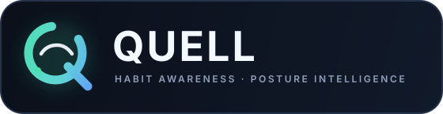

# Habits



Personalized, real-time webcam models for detecting hair-touching and seated
posture. The project uses MediaPipe landmarks, scikit-learn classifiers, and
OpenCV interfaces for data collection and live feedback.

The two models are independent:

- **Hair touching:** recognizes when either hand is near the hair/head region.
- **Posture:** learns your own examples of good and bad seated posture.

Neither model sends video to a server. Frames are processed locally. The saved
CSV datasets and pickle files are ignored by Git because they contain personal
training data and machine-specific models.

## Features

### Hair-touching model

- MediaPipe Hand Landmarker and Face Landmarker
- Two-hand tracking with face/head reference points
- 136 features: normalized hand shape, 3D hand-to-head distances, z-offsets,
  and a global wrist-to-nose depth cue
- Session-aware evaluation to reduce leakage between adjacent video frames
- Random Forest, Gradient Boosting, and Logistic Regression comparison
- Live confidence smoothing and touch-event counting

### Advanced posture model

- MediaPipe Full Pose Landmarker
- 71 adaptive 2D/3D and biomechanical features
- Normalized head, ear, shoulder, elbow, and optional hip landmarks
- Shoulder slope, head centering, neck tilt, head depth, torso lean, hip slope,
  and torso-depth measurements
- Adaptive desk-camera mode: only the nose and both shoulders are required
- Low-visibility landmarks are masked instead of injecting unstable estimates
- Hips add torso information when visible; hip-dependent readings become `n/a`
  when they are below the frame
- Collection limited to about eight samples per second to reduce duplicate data
- Up to five-fold stratified group validation with complete sessions held out
- Extra Trees, Random Forest, robust Logistic Regression, and soft-voting
  ensemble comparison
- Cross-validated decision-threshold tuning
- Full-data refitting after model selection
- Personalized good-posture baseline and issue explanations
- Unfamiliar-pose detection for inputs outside the training distribution
- Exponential smoothing, hysteresis, and warning/recovery dwell times
- Live shoulder, torso, neck, head-offset, and depth readings

## Project Structure

| File | Purpose |
| --- | --- |
| `features.py` | Hair-touching feature extraction |
| `collect.py` | Hair-touching data collection |
| `train.py` | Hair-touching model training |
| `webcam.py` | Combined hair-touching monitor with optional posture layer |
| `posture_features.py` | Adaptive posture features and interpretable metrics |
| `posture_runtime.py` | Pose detector, model validation, uncertainty, and smoothing |
| `collect_posture.py` | Good/bad posture data collection |
| `train_posture.py` | Group validation, ensemble selection, calibration, and profiling |
| `posture.py` | Standalone live posture monitor |
| `quell_app.py` | Unified modern dashboard for both models |
| `quell_stats.py` | Local session history, reduction metrics, and interventions |
| `pyproject.toml` | Installable `quell` command and Python package metadata |
| `assets/quell-logo.svg` | Primary horizontal Quell logo |
| `assets/quell-mark.svg` | Standalone scalable app/logo mark |

## Installation

Python 3.10 or newer is recommended.

```bash
python -m pip install opencv-python mediapipe scikit-learn pandas numpy pillow
```

To install the unified `quell` command from this repository:

```bash
python -m pip install -e .
```

The first relevant run downloads MediaPipe `.task` model assets. The hand,
face, and full-pose assets are stored locally and ignored by Git.

## Camera Selection on macOS

OpenCV uses numeric camera indices. macOS assigns these indices dynamically,
so the number does not reliably identify a particular camera.

On the current setup:

- Camera `0` has appeared as OBS Virtual Camera.
- Camera `1` may be the Mac camera or an iPhone Continuity Camera, depending on
  what macOS exposes when the program starts.

The posture tools currently default to camera `1`:

```bash
python collect_posture.py --camera 1 --view front
python posture.py --camera 1
```

To try another exposed camera:

```bash
python collect_posture.py --camera 0 --view front
```

The combined monitor uses the `QUELL_CAMERA` environment variable:

```bash
QUELL_CAMERA=1 python webcam.py
```

If macOS selects an iPhone unexpectedly, stop the program, disconnect
Continuity Camera on the iPhone, and restart. To disable it permanently on the
iPhone, open **Settings → General → AirPlay & Continuity → Continuity Camera**.

## Unified Quell App

The recommended interface packages both models into one local desktop
dashboard:

```bash
# After `python -m pip install -e .`
quell --camera 1

# Or run it directly without installing the command.
python quell_app.py --camera 1
```

The app provides one camera view and three coordinated layers:

- **Hair habit:** live probability, touch count, touches per hour, current
  touch-free streak, historical best streak, rate trend, and reduction from
  baseline
- **Posture:** alignment score, good-posture percentage, correction count,
  shoulder slope, neck tilt, head offset, head depth, torso lean when hips are
  visible, pose quality, and unfamiliar-pose state
- **Interventions:** non-destructive habit interruption, sustained-posture
  resets, recovery timing, prompt-success rate, and a 25-minute microbreak

Controls:

- **P:** pause/resume session measurement
- **D:** toggle more detailed landmark overlays
- **M:** toggle mirror mode
- **F:** toggle fullscreen
- **Q**, **Esc:** save the eligible session and quit

### Behavior-change statistics

Sessions longer than ten seconds are saved locally to `quell_history.json`.
The file is ignored by Git. Sessions of at least one minute contribute to trend
and baseline statistics.

- The first three qualifying sessions establish the hair-touch-rate baseline.
- Reduction is calculated from current touches/hour versus that baseline.
- A hair intervention is considered successful when the hands reset within 12
  seconds of the prompt.
- A posture intervention appears after ten sustained seconds of bad posture and
  records time-to-recovery.
- The dashboard reports intervention success rate and average recovery time.

The app never closes tabs or performs punitive actions. Interventions are
on-screen, brief, and designed around returning to a neutral behavior rather
than demanding rigid stillness.

### Model availability

- If `quell_model.pkl` is missing, the dashboard remains usable but shows that
  the hair model needs training.
- If `posture_model.pkl` is missing or incompatible, the app uses conservative
  geometry guidance and labels the posture model state accordingly.
- Once compatible models exist, they are loaded automatically at startup.

### UI preview without camera access

The demo renderer initializes no camera or MediaPipe detectors:

```bash
python quell_app.py --demo
python quell_app.py --demo --screenshot dashboard.png
```

## Hair-Touching Workflow

### 1. Collect data

```bash
python collect.py
```

Controls:

- **T:** hold to record touching hair (`1`)
- **N:** hold to record not touching (`0`)
- **C:** clear samples from the current run
- **S:** save and quit
- **Q:** discard the current run

Data is appended to `landmarks.csv`. Each run receives a session ID.

### 2. Train

```bash
python train.py
```

The best evaluated pipeline is saved to `quell_model.pkl`.

### 3. Run

```bash
python webcam.py
```

`webcam.py` requires `quell_model.pkl`. If `posture_model.pkl` also exists and
matches the current posture feature schema, the posture layer activates
automatically.

## Posture Workflow

### Framing

Use your normal seated position. Keep these landmarks visible:

- Your head/nose
- Your complete left shoulder
- Your complete right shoulder

Hips are optional. If visible, they provide better torso-lean and torso-depth
measurements. If hidden by a normal desk-camera crop, the model continues with
head, neck, shoulder, and upper-body depth cues.

### 1. Collect at least three sessions

```bash
python collect_posture.py --camera 1 --view front
```

Controls:

- **G:** hold to record good posture (`0`)
- **B:** hold to record bad posture (`1`)
- **C:** clear samples from the current run
- **S:** save and quit
- **Q:** discard the current run

Every session should include both labels. Record at least 40 samples of each
class, although several hundred varied samples per class are preferable. Avoid
recording one perfectly still pose for a long time.

For good posture, include comfortable natural variation. For bad posture,
include the patterns you want the system to recognize, such as:

- Forward head
- Rounded or collapsed shoulders
- Leaning to either side
- Slumping lower in the chair
- Moving too close to the display

Run collection at least three separate times so validation can hold out entire
sessions. Vary lighting, clothing, chair position, and natural movement.

Samples are appended to `posture_landmarks.csv` with a session ID, view type,
71 features, and the label.

### 2. Train the advanced model

```bash
python train_posture.py --view front
```

Training reports:

- Session-grouped cross-validated balanced accuracy
- Accuracy and bad-posture F1
- Pose-diversity ratio
- Tuned decision threshold
- Confusion matrix
- Most influential features
- Selected classifier or ensemble

The selected model is refit on every labeled sample and saved as
`posture_model.pkl`. The bundle also contains the feature schema version,
personal good/bad profiles, robust feature ranges, novelty limit, and evaluation
summary.

### 3. Run posture by itself

```bash
python posture.py --camera 1
```

Before training, `posture.py` uses conservative geometry guidance. After
training, it uses the personalized model, calibrated threshold, personal
baseline, novelty detection, and temporal smoothing.

### 4. Run both models together

```bash
QUELL_CAMERA=1 python webcam.py
```

The combined monitor loads `quell_model.pkl` and enables posture automatically
when a compatible `posture_model.pkl` is present.

## Front View or Side View?

A front view is useful for shoulder balance, head centering, neck tilt,
sideways torso lean, distance changes, and personalized visual slouch patterns.
It is the recommended starting point for a laptop webcam.

A side view is better for forward-head posture, rounded-back slouch, and
sagittal alignment. Use a consistent view while building a small dataset. Do
not casually mix front and side frames into one model. If you want a side model,
collect multiple side sessions and train with:

```bash
python collect_posture.py --camera 1 --view side
python train_posture.py --view side
```

This replaces `posture_model.pkl` with the side-view model, so rename or back up
an existing front-view model first if you want to keep both.

## Data and Model Files

### Hair touching

- `landmarks.csv`: 136 features + session + label
- `quell_model.pkl`: selected scikit-learn pipeline

### Posture

- `posture_landmarks.csv`: 71 features + session + view + label
- `posture_model.pkl`: fitted estimator, threshold, schema, profiles, novelty
  ranges, and evaluation metadata

CSV datasets, pickle models, MediaPipe task assets, and Python caches are ignored
by `.gitignore`. `quell_history.json` is also ignored because it contains local
behavior statistics.

## Troubleshooting

### It says the pose is not in frame

- Restart the collector to ensure the latest adaptive feature code is loaded.
- Keep the nose and both shoulders visible; hips are not required.
- Make sure the selected camera shows you rather than OBS or another source.
- Improve lighting and avoid cutting either shoulder off at the window edge.

### It opens the iPhone camera

macOS selected Continuity Camera for that OpenCV index. Stop the program,
disconnect the iPhone camera, and restart. Camera numbers may change after the
available devices change.

### It shows the OBS logo or a camera-off screen

That camera index points to OBS Virtual Camera. Try the other index, or start an
OBS virtual-camera feed intentionally.

### `Could not open camera N`

The index is not currently exposed or another application owns the camera. Try
`--camera 0` or `--camera 1`, close other camera applications, and confirm macOS
camera permission for the terminal/Python application.

### The posture CSV is missing current features

The adaptive upper-body update changed the posture feature schema. Move or
delete the old `posture_landmarks.csv`, recollect, and retrain. Do not combine
rows from different feature schemas.

### The posture model predates adaptive features

Run `python train_posture.py --view front` again using a current 71-feature CSV.
Old model bundles are rejected instead of being used with incompatible feature
semantics.

### Low real-world accuracy

- Collect more sessions, not merely more adjacent frames.
- Include both labels in every session.
- Record realistic borderline examples.
- Keep the camera position reasonably consistent between collection and use.
- Review the session-grouped metrics rather than training accuracy.
- Treat an implausibly perfect score from one session as possible leakage or
  insufficient variation.

### MediaPipe feedback-manager warnings

Messages about feedback tensors being disabled are normal for these task files
and do not mean inference failed.

## Technical Notes

- Hair features are wrist-centered and normalized by palm scale.
- Posture image and world landmarks are shoulder-centered and normalized by
  shoulder width.
- Pose landmarks below the visibility threshold are replaced with zeroed
  coordinates, while aggregate and hip-specific visibility are retained as
  model inputs.
- Hip-dependent features are disabled when hip visibility is below the adaptive
  threshold.
- A low-visibility score is retained as a model input so the estimator can learn
  the limits of the camera setup.
- Session grouping prevents temporally adjacent frames from appearing in both
  training and validation folds.
- The final posture estimator is trained on all samples only after model and
  threshold selection are complete.

## Requirements

- Python 3.10+
- OpenCV 4.5+
- MediaPipe 0.10+
- scikit-learn with `StratifiedGroupKFold` support
- pandas, NumPy, and Pillow

## Safety

Posture feedback is behavioral guidance, not a medical diagnosis. Body
proportions, disability, pain, camera perspective, and comfortable posture vary
between people. Train labels around your own comfortable baseline and consult a
qualified professional for medical or ergonomic concerns.
